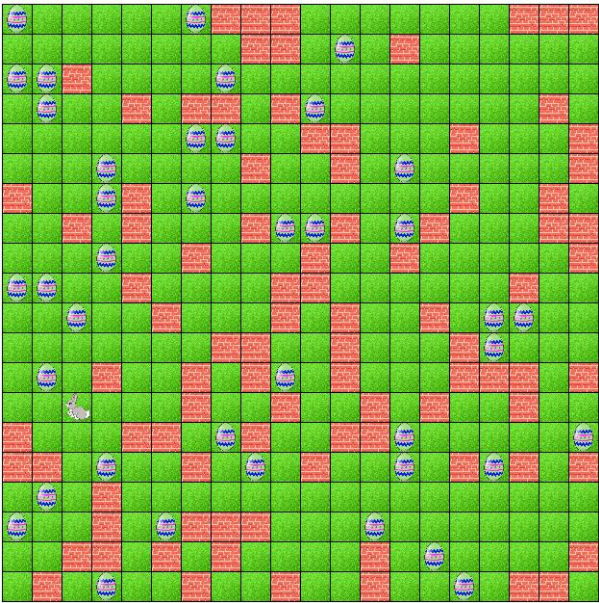

# Projekt EggHunt - Wykorzystanie algorytmu genetycznego do pomocy królikowi wielkanocnemu w optymalnym znajdowaniu jajek wielkanocnych.
### Autorzy: Paweł Martyniuk, Iwo Sokal
Zadanie polega na znalezieniu optymalnej strategii dla królika, aby efektywnie znajdował jajka wielkanocne oraz nie uderzył w ścianę. Zakładamy siatkę 2D (N x N wymiarową), każde pole może mieć jeden z trzech stanów: być puste, może znajdować się na nim jajko, może być ścianą. Królik może poruszyć się góra / lewo / dół / prawo, poruszyć się losowo, podnieść jajko, stać w miejscu (7 akcji).
# Środowisko
Aplikacja została napisana w systemie operacyjnym Windows w środowisku QT Creator z wykorzystaniem C++. Używamy QT 5 zamiast interfejsu konsolowego, ponieważ w ten sposób lepiej jest zobrazowany wynik działania algorytmu ewolucyjnego, a sama aplikacja jest bardziej przyjazna w użytkowaniu oraz ładniejsza.
# Instrukcja
Aplikację można uruchomić przy użyciu QT Creatora.
Przy uruchamianiu programu użytkownik musi zdefiniować następujące parametry: generations, populationSize, specimenLength, crossoverProbability, mutationProbability.
# Ewaluacja
Dla ziarna 100 została wygenerowana następująca plansza o rozmiarze 20x20 z 40 jajami.

Zastosowane następujące parametry:
* Liczba generacji: 1000
* Rozmiar populacji: 20
* Rozmiar osobnika: 40
* Prawdopodobieństwo krzyżowania: 20%
* Prawdopodobieństwo mutacji: 100%

Rozwiązanie: 12/40 jaj zdobytych w 40 ruchach.